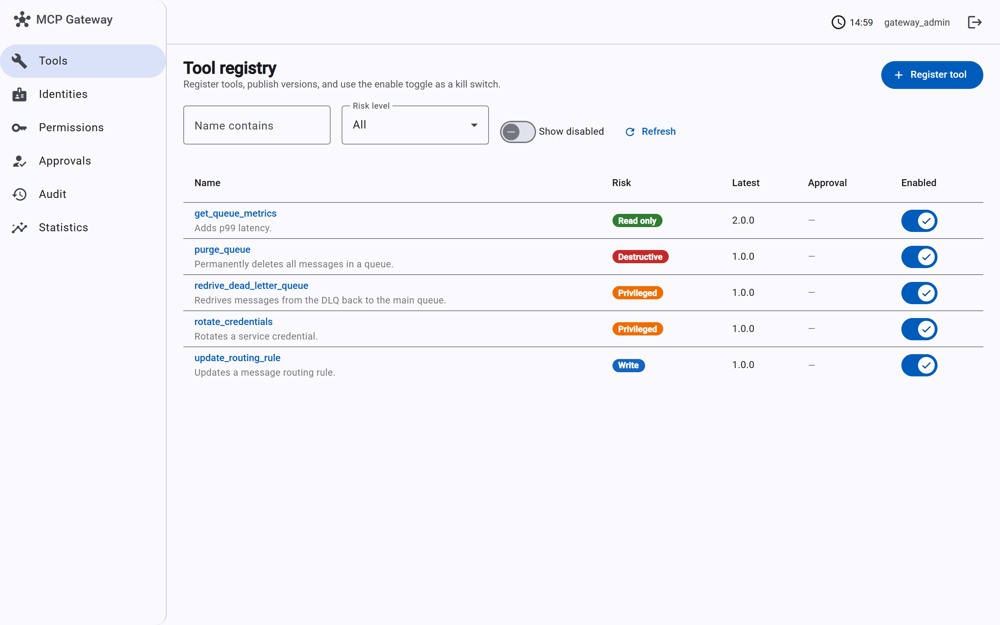
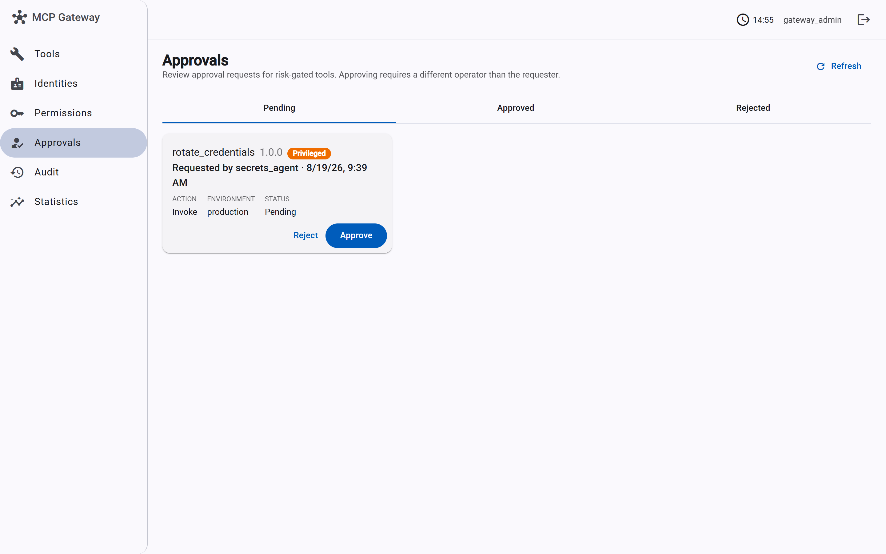
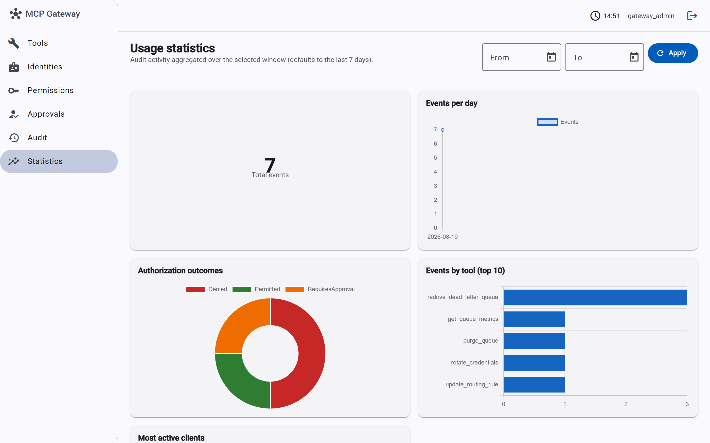

# MCP Gateway 🛡️

An enterprise gateway that safely exposes internal capabilities to AI agents through MCP. Agents never talk to internal services directly — every tool call passes through authentication, policy-based authorization, schema validation, risk classification, and audit logging.

## Why

Giving an agent raw access to infrastructure is a non-starter in any real organization. This gateway treats tools as governed infrastructure: registered, versioned, permissioned, and auditable — with human approval gates for privileged actions and kill switches for everything.

## Architecture

```text
Agent → MCP Gateway → [ AuthN → AuthZ → Policy → Validation → Audit ] → Internal Services
```

Risk classes drive policy: `ReadOnly` runs automatically, `Privileged` requires approval, `Destructive` is prohibited or multi-party.

## Stack

.NET 10 · ASP.NET Core · PostgreSQL · EF Core · Angular · OpenTelemetry · Docker Compose · xUnit + Testcontainers

## Status ✅

All seven planned phases are complete — see [docs/PLAN.md](docs/PLAN.md) for the build plan and [docs/adr/](docs/adr/) for the decisions behind them.

- [x] Phase 1 — Tool registry (registration, discovery, versioning, kill switch, deprecation)
- [x] Phase 2 — Authentication (user/agent/service identities, OAuth2 client credentials, JWT bearer)
- [x] Phase 3 — Authorization (deterministic ABAC engine: kill switch, version lifecycle, scope coverage)
- [x] Phase 4 — Risk classification (risk drives the outcome: automatic, requires approval, or prohibited)
- [x] Approval engine — request/approve/reject workflow with four-eyes that makes `RequiresApproval` actionable
- [x] Phase 5 — Audit trail (append-only record of every authorization and approval event, with hashed inputs and trace ids)
- [x] Phase 6 — Angular admin console (registry, identities, permissions, approvals, audit, kill switches, usage statistics)
- [x] Phase 7 — Attack testing (executable red-team scenarios for the threat model; audit reads hardened to operators)

## Admin console

<p align="center">
  <a href="docs/screenshots/tool-registry.png"></a>
  <a href="docs/screenshots/approvals.png"></a>
  <a href="docs/screenshots/usage-statistics.png"></a>
</p>

Tool registry · pending approvals · usage statistics. More screens in [docs/screenshots/](docs/screenshots/).

## Running Locally

```bash
docker compose up --build
```

The API starts on `http://localhost:8080` and the admin console on `http://localhost:4200`. The API applies migrations automatically and seeds a bootstrap admin identity (`gateway_admin` / `local-dev-bootstrap-secret` — local dev only), which holds the `gateway.admin` scope. Management endpoints (identity administration, registry mutations, approval decisions) require that scope; discovery, authorization decisions, and approval requests are open to any authenticated caller so agents can use them. All APIs require a token. Get one, then register and discover a tool:

```bash
TOKEN=$(curl -s -X POST http://localhost:8080/oauth/token \
  -d "grant_type=client_credentials&client_id=gateway_admin&client_secret=local-dev-bootstrap-secret" \
  | jq -r .access_token)

curl -X POST http://localhost:8080/api/tools \
  -H "Authorization: Bearer $TOKEN" \
  -H "Content-Type: application/json" \
  -d '{
    "name": "get_queue_metrics",
    "version": "1.0",
    "description": "Returns queue depth and consumer lag.",
    "riskLevel": "ReadOnly",
    "approvalRequired": false,
    "requiredScopes": ["queue.read"],
    "timeoutSeconds": 10,
    "inputSchema": {"type": "object"},
    "outputSchema": {"type": "object"}
  }'

curl -H "Authorization: Bearer $TOKEN" http://localhost:8080/api/tools
```

Identities are managed at `/api/identities`; client secrets are generated server-side, returned exactly once, and stored only as PBKDF2 hashes.

### Authorization

Before an action runs, ask the gateway whether it is allowed. A deterministic policy engine evaluates the kill switch, version lifecycle, scope coverage, and — once access is granted — the tool's risk class. The caller's scopes come from its token, never from the request body, so a caller cannot widen its own grant:

```bash
curl -X POST http://localhost:8080/api/tools/redrive_dead_letter_queue/authorize \
  -H "Authorization: Bearer $TOKEN" \
  -H "Content-Type: application/json" \
  -d '{ "action": "Invoke" }'
```

The response is HTTP 200 for every evaluation — a deny or an approval requirement is a successful evaluation, not an error. Branch on `outcome`:

```json
{
  "outcome": "RequiresApproval",
  "permit": false,
  "toolName": "redrive_dead_letter_queue",
  "version": "1.0.0",
  "action": "Invoke",
  "reasons": [{ "code": "ApprovalRequired", "message": "Version 1.0.0 of 'redrive_dead_letter_queue' requires human approval before it can run." }]
}
```

Risk class drives the outcome for an invocation (discovery is never risk-gated):

| Risk | Outcome |
|------|---------|
| `ReadOnly` / `Write` | `Permitted` (runs automatically once scopes are held) |
| `Privileged` (or any version flagged `approvalRequired`) | `RequiresApproval` |
| `Destructive` | `Prohibited` |

Access rules run first: a missing scope, disabled tool, or deprecated version returns `Denied` before risk is ever considered. Omit `version` to target the latest active version. This decision endpoint is the gate that tool execution will call through in later phases.

### Approvals

A `RequiresApproval` outcome is made actionable by the approval workflow. The requester opens a request; a **different** principal approves it (four-eyes is enforced — an approver can never be the requester); the original caller then re-authorizes and is permitted:

```bash
# 1. Agent opens an approval request (requester is taken from the token)
APPROVAL=$(curl -s -X POST http://localhost:8080/api/tools/redrive_dead_letter_queue/approvals \
  -H "Authorization: Bearer $AGENT_TOKEN" -H "Content-Type: application/json" -d '{}' | jq -r .id)

# 2. An operator approves it (must be a different identity)
curl -X POST http://localhost:8080/api/approvals/$APPROVAL/approve \
  -H "Authorization: Bearer $ADMIN_TOKEN" -H "Content-Type: application/json" -d '{ "note": "reviewed" }'

# 3. The agent re-authorizes — now Permitted
curl -X POST http://localhost:8080/api/tools/redrive_dead_letter_queue/authorize \
  -H "Authorization: Bearer $AGENT_TOKEN" -H "Content-Type: application/json" -d '{}'
```

Pending requests are listed at `GET /api/approvals?status=Pending`. An approval is a standing grant for that `(requester, tool, version)` until execution can consume it (a later phase); approving is refused for tools that run automatically or are prohibited.

### Audit

Every authorization decision and approval event is recorded to an append-only audit trail — including denials and blocked privileged attempts. Each entry captures who acted, the tool/version, the result, a trace id correlating it to the request, and a SHA-256 hash of the request context (sensitive values such as a resource ARN are hashed, never stored raw):

```bash
curl -H "Authorization: Bearer $TOKEN" \
  "http://localhost:8080/api/audit?toolName=redrive_dead_letter_queue&eventType=AuthorizationDecision"
```

```json
[
  {
    "occurredAt": "2026-08-14T18:00:00+00:00",
    "traceId": "0af7651916cd43dd8448eb211c80319c",
    "eventType": "AuthorizationDecision",
    "actorClientId": "incident_agent",
    "result": "RequiresApproval",
    "toolName": "redrive_dead_letter_queue",
    "version": "1.0.0",
    "detail": "ApprovalRequired",
    "requestHash": "9f2c…",
    "approvalId": null
  }
]
```

Filter by `toolName`, `actor`, `eventType`, and a `from`/`to` time window; results come back newest-first. `GET /api/audit/stats?from=&to=` returns the same activity aggregated server-side (counts by event type, tool, authorization outcome, actor, and per day) over a window that defaults to the last seven days — this backs the console's statistics dashboard.

### Admin console

The Angular admin console at `http://localhost:4200` is a browser front-end over the same API. Sign in with a client id and secret (the console exchanges them for a token at `/oauth/token`; the token is held in memory only and the secret is never stored). For local dev, sign in as `gateway_admin` / `local-dev-bootstrap-secret`.

It covers the full Phase 6 surface: tool registry with inline enable/disable **kill switches**, agent identities (register, rotate secret, disable), a permissions view of who holds each scope, pending approvals with approve/reject, audit history, and a usage-statistics dashboard. Operator-only actions are hidden when the signed-in identity lacks `gateway.admin`.

Develop the console against a running API with the dev proxy:

```bash
cd src/McpGateway.AdminConsole
npm install
npm start   # ng serve on http://localhost:4200, proxying /api and /oauth to :8080
```

### Security

The controls above are backed by executable red-team scenarios in
`tests/McpGateway.IntegrationTests/Security/` — privilege escalation, token forgery,
version downgrade, tool spoofing, cross-identity grant isolation, parameter injection,
and secret leakage — each asserting that a defense holds, so a regression fails the
build. [docs/THREAT-MODEL.md](docs/THREAT-MODEL.md) maps every attack to its control and
test, and is explicit about what is deferred until tool execution exists (prompt
injection in tool results, oversized responses).

Tests (integration tests spin up Postgres via Testcontainers — Docker required):

```bash
dotnet test                                   # backend, incl. Security/ attack suite
cd src/McpGateway.AdminConsole && npm test    # console (Karma/Jasmine)
```
